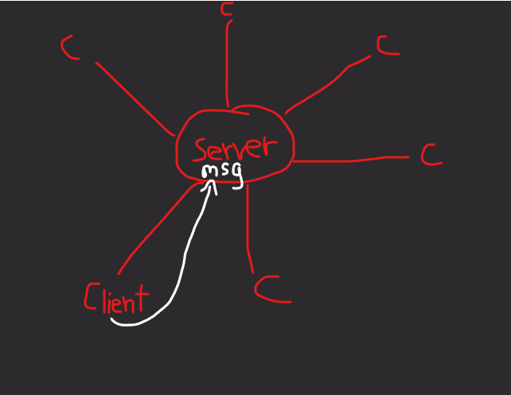
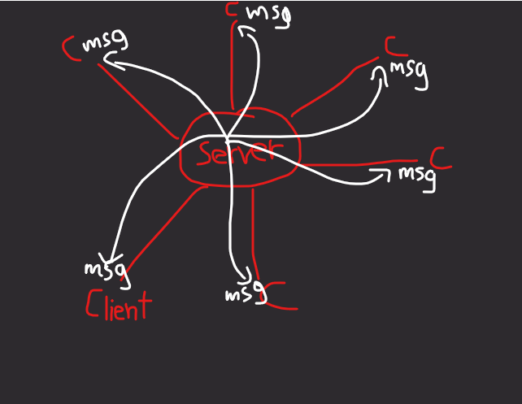

# web-chat-app
This was taken from: https://www.youtube.com/playlist?list=PLyb_C2HpOQSBUEDI7tx_W4hAz699B6D7p

## What is it?
This is a chat app which runs on your browser.

## How does it work?
You first login/sign up. Then you create your own chat rooms, edit them, chat in them and add people to it. You can also chat in the chat rooms which you've been invited to.

Thats it. Enjoyy!!

## How to run it?
Just type ```python app.py```

## What's the logic behind the sockets?
**Some terminologies: the *client* means the html page (view_room.html). The *server* means the python application (app.py).**

### This is how it works graphically:
This is a client sending a message to the server.


Then, the server broadcasts that message to all the clients. Each client then receives that message and does someaction based on what that message is telling them to do.



### This is how it works in a nutshell:
Each client sends a message to the server directly. The server then sends that message to all the clients (including to the client which sent that message to them).


### Here's how exactly the sockets work:
The sockets are used for 3 purposes: to announce someone joining a room, to announce someone leaving a room and to send a chat message. Let's see how they work. 

**1 other terminology: Message means event. When I say that a client/server sent a message to another client/server, I mean it sent an event. That event can contain a message with it. A playload as some call it.**

1. Joining room - As soon the client gets connected, it sends a "join_room" event to the server. When the server hears that event, it sends back a "join_room_announcement" event. Now, all the clients will listen for that event and once they hear it, get the message that was sent with the event.

2. Sending a message - Whenever the client sends a chat message to the chat room, a "send_message" event gets sent to the server and along with it, the chat message which the client sent to the chat room. The server listens for it and hears it. Upon hearing it, the server sends a "receive_message" event and the payload it received back to all the clients. Remember, the payload was the chat message that the client sent to the server along with the event it sent. Now, all the clients hear the "receive_message" event and get the payload.

3. Leaving room - As soon the client leaves a chat room, it sends a "leave_room" event to the server. The server hears it and sends back a "leave_room_announcement" to all the clients. The clients hear it and perform a certain action with the message/payload they received with that event.

That's it!
I hope this made some sense.
